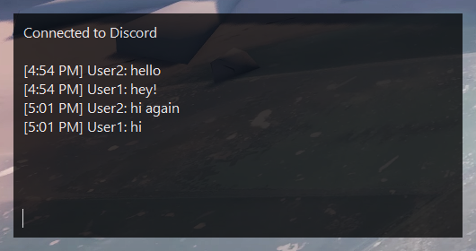

# FloatChat

FloatChat is a desktop application that provides a Discord-powered text chat overlay on top of other applications.

[](https://github.com/shibijm/floatchat/releases/latest)
[](https://github.com/shibijm/floatchat/actions/workflows/release.yml)



## Download

Downloadable builds are available on the [releases page](https://github.com/shibijm/floatchat/releases).

## Configuration

The application's configuration is stored in `%APPDATA%\FloatChat\config.json`.

### Example

```json
{
	"botToken": "DISCORD_BOT_TOKEN",
	"channelId": 457918764216748594,
	"nick": "User1",
	"processName": "Borderlands3",
	"alwaysShowInProcess": false,
	"hideTimer": 10,
	"newMessageHideTimer": 10,
	"sizeX": 500,
	"sizeY": 250,
	"locationX": 25,
	"locationY": 890,
	"activeOpacity": 0.75,
	"inactiveOpacity": 0.5,
	"chatBoxFont": "",
	"chatBoxFontSize": 15,
	"inputBoxFont": "",
	"inputBoxFontSize": 15
}
```
